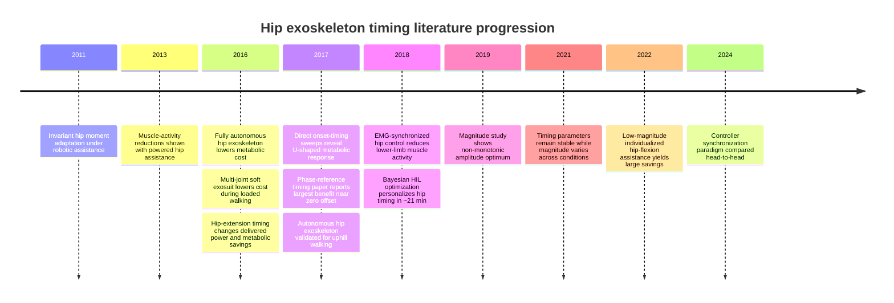

# Assistance Timing in Hip Exoskeletons Often Matters as Much as or More Than Assistance Magnitude

## Executive Summary

Across the modern hip-exoskeleton literature, the strongest line of evidence comes from experimental programs centered at entity["organization","Harvard University","Cambridge, MA, US"], entity["organization","Georgia Institute of Technology","Atlanta, GA, US"], entity["organization","Stanford University","Stanford, CA, US"], and entity["organization","EPFL","Lausanne, VD, CH"]. Collectively, these studies support a nuanced but strong claim: for hip assistance, **phase alignment, onset/peak/offset timing, and synchronization latency frequently change metabolic benefit by amounts comparable to, and sometimes larger than, moderate changes in assistance magnitude**. The underlying reason is biomechanical: at the hip, delivered assistive work depends strongly on when force is applied relative to hip angular velocity and to the wearer’s neuromuscular state, so the same nominal peak torque can produce substantially different positive work, joint compensation patterns, and whole-body economy depending on timing. citeturn18view0turn15view0turn16view1turn33view0turn38view0

The most persuasive direct timing evidence is not merely correlational. Multiple studies held peak force or hardware fixed and changed timing alone, finding meaningful differences in delivered positive power and metabolic cost. In Ding et al. 2016, changing hip-extension timing while keeping peak force constant shifted exosuit-delivered positive mechanical power and changed metabolic savings from 5.7% to 8.5%. In Young et al. 2017, timing was a significant factor and the best subject-specific onset timings reduced metabolic cost by about 10% for either flexion or extension assistance; early-vs-late extension onset also changed the size of the benefit substantially. In Lee et al. 2017, metabolic cost followed a concave-up timing curve, with the best timing reference yielding a 21% reduction relative to walking without the exoskeleton. In Ding et al. 2018, Bayesian human-in-the-loop optimization of **timing parameters** alone delivered a 17.4% average metabolic reduction. In Kim et al. 2022, low-magnitude hip-flexion assistance still reduced metabolic cost by 15.2% once timing and profile shape were individualized, while prominent fixed “biologically inspired” timings did not significantly reduce cost at the explored assistance levels. citeturn18view0turn16view1turn29view0turn33view0turn40view1

Magnitude still matters, and the literature does **not** support the stronger claim that timing universally dominates magnitude. Quinlivan et al. 2017 showed that larger assistance magnitudes in a multiarticular soft exosuit can drive larger metabolic reductions, and Kang et al. 2019 showed that assistance magnitude has an optimum rather than a simply monotonic effect. But those magnitude studies actually sharpen the timing argument: once assistance is “in the right ballpark,” the marginal gain from more torque can flatten or reverse, whereas timing shifts can still move the device from poorly aligned to highly aligned with the biomechanical task. In other words, there is strong evidence for a **timing-sensitive regime** in which phase/latency errors are at least as consequential as moderate magnitude changes. citeturn37search0turn21search7turn20search12turn25search5

The five strongest evidentiary points are these:

- **Timing-only manipulations changed metabolic cost with force held fixed.** Ding et al. 2016 is the cleanest example: timing changed delivered positive hip power and shifted metabolic savings by roughly 2.8 percentage points absolute across profiles, with the best condition also reducing biological hip and knee power. citeturn18view0
- **Timing sweeps often produce U-shaped or concave-up metabolic landscapes.** Young et al. 2017 and Lee et al. 2017 both report precisely that pattern, strongly implying a real optimum rather than a monotonic “more is better” rule. citeturn16view1turn29view0
- **Human-in-the-loop timing personalization produces large benefits.** Ding et al. 2018 found a 17.4% average metabolic reduction after optimizing peak and offset timing, with clear participant-specific metabolic landscapes and convergence in about 21 minutes. citeturn33view0turn34view0
- **Low magnitude can be highly effective if timing is optimized.** Kim et al. 2022 found only ~24% of peak biological hip-flexion torque was sufficient for a 15.2% reduction, and individualized optimal timing/offset profiles outperformed fixed profiles inspired by prior literature. citeturn40view0turn40view1
- **When magnitude and timing are both examined, magnitude often shows diminishing returns or broader useful ranges than timing.** Kang et al. 2019 reported a non-monotonic magnitude relationship with an optimum around a 6% reduction, while Bryan et al. 2021 found optimized timing parameters were consistent across load conditions whereas optimized magnitudes varied, suggesting timing may be the tighter constraint. citeturn21search7turn39search5turn39search14

## Why Timing Has Such Leverage at the Hip

The hip is unusually timing-sensitive because assistive **power** is the product of assistive torque and joint angular velocity. A profile with the same peak force or torque can deliver much more or much less useful positive work depending on whether the peak occurs near the relevant velocity burst. Ding et al. 2016 made this explicit: when peak force timing was moved later during stance, the soft exosuit delivered more positive mechanical power, and that condition also produced the largest average metabolic reduction. Young et al. 2017 similarly found that hip-timing changes altered ankle and hip joint powers, not just metabolic cost, showing that timing influences whole-limb coordination rather than merely adding or subtracting “extra torque.” citeturn18view0turn16view0

There is also a mechanistic reason hip timing can matter more than raw amplitude. Multiple papers and reviews argue that positive work at the hip is metabolically expensive because hip musculature relies less on long, efficient elastic storage than the ankle does. That means replacing well-timed hip-muscle work with appropriately phased exoskeleton work can have disproportionate energetic value. Panizzolo et al. 2016 and Ding et al. 2016 both frame the hip as an attractive assistance target for this reason, and Nuckols et al. 2020 provide the broader joint-level argument linking locomotor energetics and where mechanical work is produced. citeturn19view0turn18view0turn9search7

A second reason is adaptation. Lewis and Ferris 2011 showed that people walking with a robotic hip exoskeleton tended to preserve an invariant net hip moment pattern by changing their own biological moment as external assistance changed. That result implies the user will not accept arbitrary assistance passively; instead, the nervous system reorganizes around it. If assistance arrives at the wrong phase, the person may resist it, compensate elsewhere, or alter cadence and step geometry in ways that erase the benefit. The timing effect is therefore partly a control problem and partly a human adaptation problem. citeturn9search0turn18view0

This is exactly why synchronization methods matter. In Manzoori et al. 2024, two controllers on the same hip exoskeleton produced very different metabolic and gait effects because they synchronized assistance differently: one used a reflex-like implicit synchronization with longer assistance, while the other used explicit phase estimation with short timed bursts. Even when both controllers reduced metabolic cost compared with wearing the device unassisted, the short-burst controller’s benefit was mostly erased once the device-mass penalty was referenced to normal walking without the device. That is less a story about “torque too small” than about how the timing structure and synchronization paradigm determine whether the delivered work actually helps. citeturn38view0turn38view2turn38view4

## Comparative Table of Key Papers

The table below emphasizes studies most relevant to the claim that **timing/phase/latency can matter as much as or more than magnitude**. Because baselines differ substantially across papers—no-device, device-unpowered, assistance-off, zero-impedance, and equivalent-mass-removed controls are all used—cross-paper effect sizes should be compared cautiously. citeturn19view0turn18view0turn40view1turn38view2

| Paper | Study type / N | Device type | Parameter varied | Main outcomes | Main quantitative result | Timing-vs-magnitude takeaway |
|---|---|---|---|---|---|---|
| Lewis & Ferris 2011, *J Biomech* doi: 10.1016/j.jbiomech.2011.01.030 | Human experiment; N not visible in accessible abstract | Robotic hip exoskeleton; active | External hip actuation during walking | Net hip moment pattern | Users altered biological hip moment so that the **net** hip moment pattern remained largely invariant despite exoskeleton assistance. | Foundational mechanistic paper: the user reorganizes around assistance, so the **phase relationship** between exoskeleton torque and biological demand is critical. citeturn9search0turn9search4turn18view0 |
| Lenzi et al. 2013, *IEEE TNSRE* doi: 10.1109/TNSRE.2013.2248749 | Human experiment; N not visible in accessible abstract | Powered hip exoskeleton | Assistance magnitude/profile fraction | EMG, joint mechanics | Powered hip assistance reduced hip and ankle muscle activations during walking. | Good evidence that magnitude matters as a design variable, but it is **not** a timing sweep; it is best read as a baseline magnitude/control paper rather than direct evidence against the timing claim. citeturn9search1turn18view0 |
| Seo et al. 2016, *ICRA* doi: 10.1109/ICRA.2016.7487663 | Human experiment; n=6 male | Fully autonomous bilateral hip exoskeleton | Fixed controller | Net metabolic rate | Net metabolic rate fell from 3.05 ± 0.14 to 2.65 ± 0.09 W/kg, a **13.2 ± 4.3%** reduction versus walking without the exoskeleton. | Important proof that hip assistance works, but timing was not systematically varied. It serves as a comparator showing that fixed-profile hip assistance can already be beneficial before timing optimization. citeturn13search0 |
| Panizzolo et al. 2016, *J Neuroeng Rehabil* doi: 10.1186/s12984-016-0150-9 | Human experiment; n=7 | Autonomous multi-joint soft exosuit; bilateral active hip extension + hip flexion/ankle PF coupling | Fixed bio-inspired profile | Metabolic cost, joint work, EMG | EXO\_ON net metabolic power was **7.3%** lower than equivalent-mass-removed control and **14.2%** lower than EXO\_OFF; total positive biological joint work also fell. | Foundational multi-joint study. Timing was not isolated, but the study helped establish that coordinated hip timing can translate into meaningful metabolic benefit. citeturn19view0 |
| Ding et al. 2016, *J Neuroeng Rehabil* doi: 10.1186/s12984-016-0196-8 | Human experiment; n=8 | Tethered hip-extension soft exosuit; bilateral active | **Timing** of onset and peak, with peak force held constant | Metabolic cost, exosuit positive power, kinetics, EMG | Best profile (ESLP) delivered the most positive power (**0.219 ± 0.006 W/kg**) and the largest metabolic reduction (**8.5 ± 0.9%**); the other timing profiles yielded 5.7%, 6.3%, and 7.1% reductions. | One of the clearest timing papers in the field: changing **timing alone** changed delivered power and metabolic savings. citeturn18view0 |
| Dembia et al. 2017, *PLOS ONE* doi: 10.1371/journal.pone.0180320 | Simulation | Ideal assistive devices under heavy-load walking | Joint/site and ideal assistance strategy | Predicted metabolic cost | Simulations predicted large benefits from assisting ankle PF plus hip/knee motions, with combined ideal strategies reducing cost strongly under load. | Not a timing sweep, but useful theoretically: it argues that where and when assistance replaces muscle work can strongly reshape energetic benefit. citeturn5search30 |
| Young et al. 2017, *Front Bioeng Biotechnol* doi: 10.3389/fbioe.2017.00004 | Human experiment; n=10 | Tethered pneumatic hip exoskeleton; active flexion or extension assistance | **Onset timing** for flexion and extension | Metabolic cost, joint kinematics/kinetics, preference | Timing was significant; subject-specific optimized flexion and extension timings reduced metabolic cost by **9.7%** and **10.3%**. A generic 10% extension-onset condition gave only **3.8%**, while 90% onset gave **8.4%**. | Strong direct evidence for a U-shaped timing effect. The spread due to timing is the same order as many magnitude studies. citeturn16view1turn16view0 |
| Lee et al. 2017, *ICORR* doi: 10.1109/ICORR.2017.8009297 | Human experiment; N not visible in accessible abstract | Hip-type exoskeleton; active | **Assistance timing reference** between peak hip velocity and peak assistive power | Metabolic cost, assistive power, step length, cadence, walk ratio | Net metabolic cost showed a **concave-up** timing curve, with the largest reported reduction (**21%**) at a 0% timing reference; increasing the timing reference increased step length and walk ratio and reduced cadence. | Among the strongest single-paper supports for your claim. The reported timing effect is large enough that it plainly cannot be treated as a minor secondary tuning parameter. citeturn29view0turn28search1 |
| Seo et al. 2017, *ICORR* doi: 10.1109/ICORR.2017.8009254 | Human experiment; N not visible in accessible abstract | Autonomous hip exoskeleton; active | Slope, not timing | Metabolic cost | The exoskeleton reduced metabolic cost by **13.5%, 15.5%, and 9.8%** at 0%, 5%, and 10% grade, respectively. | Not a timing paper, but it shows that modest hip torques can produce large returns, which strengthens the idea that **how** the torque is applied may be as important as its magnitude. citeturn10search1turn10search3 |
| Grazi et al. 2018, *Front Neurosci* doi: 10.3389/fnins.2018.00071 | Human experiment; N not visible in accessible abstract | Robotic hip exoskeleton; active | Implicit timing via gastrocnemius EMG control | Lower-limb muscle activity | The paper reports reduced lower-limb muscle activities at push-off under gastrocnemius myoelectric control. | Useful supporting evidence that **synchronization strategy** matters; implicit biologically anchored timing can improve coordination even when metabolic data are not the endpoint. citeturn9search2turn9search6turn9search10 |
| Ding et al. 2018, *Science Robotics* doi: 10.1126/scirobotics.aar5438 | Human experiment; n=8 enrolled, one participant excluded from metabolic analysis | Textile hip-extension soft exosuit; active | **Peak timing and offset timing**, with onset and peak force fixed | Metabolic cost, convergence time, individualized “metabolic landscape” | Optimal timings were found in **21.4 ± 1.0 min** and reduced metabolic cost by **17.4 ± 3.2%** relative to no device. Participant-specific optima varied widely. | Perhaps the strongest modern evidence that **personalized timing** is a major determinant of benefit. The timing landscape itself becomes the object of optimization. citeturn33view0turn34view0turn34view2 |
| Kang et al. 2019, *IEEE RA-L* doi: 10.1109/LRA.2019.2890896 | Human experiment; sample size not reliably visible in accessible abstract | Powered robotic hip exoskeleton; active | **Assistance magnitude / level** | Energetic cost, gait biomechanics | Accessible previews report a **non-monotonic** magnitude relationship, with a quadratic optimum corresponding to roughly **6% metabolic reduction**; simply increasing assistance did not guarantee larger benefit. | Important counterpoint: magnitude matters, but the relationship is not monotonic. This actually supports the broader thesis that once torque is “large enough,” other parameters—especially timing—become limiting. citeturn21search7turn20search12turn20search0 |
| Nuckols et al. 2020, *PLOS ONE* doi: 10.1371/journal.pone.0231996 | Biomechanics/theory paper | No exoskeleton; joint-level energetics analysis | Terrain and joint contribution | Joint moments/powers and energetics | The paper maps how ankle, knee, and hip mechanics shift across level, uphill, and downhill locomotion. | Not a control paper, but it provides the joint-level rationale for why hip-targeted assistance can be so timing-sensitive: the energetic value of assistance depends on where in the gait cycle the hip is producing or absorbing work. citeturn9search7turn18view0 |
| Sawicki et al. 2020, *J Neuroeng Rehabil* doi: 10.1186/s12984-020-00663-9 | Review | Walking and running exoskeletons across joints | Synthesis of timing, joint/site, and adaptation factors | Review of metabolic outcomes | The review notes that the largest economy gains come from well-coordinated assistance and that exoskeleton benefit depends strongly on joint, task, and control strategy. | Broad review support for the claim. It also cautions against naive cross-paper comparisons because device mass, baseline choice, adaptation, and control representation differ markedly. citeturn8search6turn8search14 |
| Bryan et al. 2021, *J Neuroeng Rehabil* doi: 10.1186/s12984-021-00955-8 | Human experiment; n=3 | Hip-knee-ankle emulator; active whole-leg assistance | Load and human-in-the-loop optimization of timing/magnitude | Metabolic cost, optimized torque parameters | Whole-leg assistance reduced metabolic cost by **48%, 41%, and 43%** across no/light/heavy load conditions; importantly, **optimized timing parameters were consistent across participants and load conditions while magnitudes varied**. | Not hip-only, but highly relevant methodologically: timing looked like the tighter constraint, while magnitude had a broader useful range or needed more customization. citeturn39search5turn39search14turn39search9 |
| Poggensee & Collins 2021, *Science Robotics* doi: 10.1126/scirobotics.abf1078 | Review / experimental perspective | Exoskeleton assistance broadly | Adaptation, training, customization | Metabolic and training outcomes | The paper shows that assistance gains can increase substantially with training and customization. | Crucial qualifier: the apparent importance of timing can be underestimated if users are not given enough exposure to adapt to the assistance profile. citeturn8search3turn8search7turn8search11 |
| Kim et al. 2022, *Scientific Reports* doi: 10.1038/s41598-022-14784-9 | Human experiment; n=8 male main study, n=3 portable follow-up | Tethered and portable hip-flexion soft exosuit; active | **Individualized timing and magnitude** vs fixed profiles | Metabolic cost, force/timing optima, biomechanics, EMG | Optimized assistance reduced metabolic cost by **15.2 ± 2.6%** vs assistance-off; optimal peak torque was only about **0.146 Nm/kg** (~24% of peak biological hip flexion), and fixed muscle-inspired / torque-inspired timings did not significantly reduce cost at explored magnitudes. | This is exceptionally strong support for your claim because it shows **low magnitude + optimized timing** can outperform more canonical fixed timings. citeturn40view0turn40view1 |
| Lora-Millan et al. 2022, *Front Bioeng Biotechnol* doi: 10.3389/fbioe.2022.842294 | Review | Partial exoskeleton control strategies | Synchronization and control taxonomy | Review | The review organizes exoskeleton controllers by how they synchronize assistance to gait and argues that coordination with human gait is central to performance. | Strong review-level support that “timing” should be interpreted broadly: onset/offset phase, synchronization paradigm, and latency all belong to the same coordination problem. citeturn8search4turn8search8 |
| Xu et al. 2023, *Front Bioeng Biotechnol* doi: 10.3389/fbioe.2023.1006326 | Human experiment / proof-of-concept; n=1 for HITL demonstration in accessible preview | Portable hip exoskeleton; active | Online HITL parameter optimization using estimated metabolic cost | Estimated metabolic cost, interaction torque | In the accessible preview, HITL reduced metabolic cost by **7.3%** vs zero-torque and **5.9%** vs no-device, while reducing interaction torque by **32.3%**. | Early but relevant: portable hip exoskeletons can benefit from online timing/personalization, reinforcing the idea that timing is an operational control variable, not just a lab curiosity. citeturn13search14turn13search13 |
| Manzoori et al. 2024, *Front Bioeng Biotechnol* doi: 10.3389/fbioe.2024.1324587 | Human experiment; n=23 | Augmentative hip exoskeleton; active | **Synchronization paradigm**: implicit reflex-like controller vs explicit hip-phase torque bursts | Net metabolic rate, cadence, limb powers, exo work | The phase-based short-burst controller reduced metabolic rate by **11.6%** relative to wearing the exoskeleton unassisted, but only **1.7%** versus no exoskeleton; the reflex-like controller delivered significantly more work and altered cadence and limb power more strongly. | Excellent recent evidence that **how assistance is synchronized** can dominate the apparent benefit once exoskeleton mass and coordination costs are accounted for. citeturn38view0turn38view2turn38view4 |

## Synthesis of the Evidence

The cleanest version of your statement is not “timing always dominates magnitude,” but rather this: **in hip exoskeletons, timing often acts as a first-order determinant of whether assistance is converted into useful mechanical work and metabolic benefit at all, whereas magnitude often acts as a second-order determinant once assistance is delivered in the right phase window.** That is what makes timing appear “as important as or more important than” magnitude in many hip studies. The literature repeatedly shows large gains from choosing the correct onset/peak/offset region and substantially smaller or non-monotonic gains from simply increasing amplitude. citeturn18view0turn16view1turn29view0turn21search7

A useful way to organize the literature is by how “clean” the timing manipulation is. The strongest support comes from studies that either fixed magnitude and changed timing directly, or fixed hardware and optimized timing parameters while keeping force magnitude constrained. Ding 2016, Young 2017, Lee 2017, and Ding 2018 all fall into that category. These papers converge on three repeated observations: metabolic cost as a function of timing is often U-shaped or concave-up; the best timings are typically near biologically meaningful events such as maximum hip flexion or early stance power bursts; and participant-specific optimization often outperforms a single generic timing derived from group means. citeturn18view0turn16view1turn29view0turn33view0

The second line of support comes from “low magnitude, high coordination” studies. Kim 2022 is especially important here because it demonstrates that relatively small hip-flexion torques—about one quarter of peak biological hip-flexion torque—can still produce large metabolic reductions if their timing and offset are individualized. That result is hard to reconcile with a magnitude-dominant view. It instead suggests that, at least for hip flexion, **well-timed modest assistance can be more efficient than poorly timed larger assistance**. citeturn40view0turn40view1

The most relevant counterevidence comes from magnitude-focused work. Quinlivan 2017 and related soft-exosuit research make it clear that larger assistance can improve economy, and Kang 2019 shows that there is a meaningful amplitude optimum. So the sensible conclusion is interaction rather than exclusivity: **timing and magnitude interact**, but timing often has a steeper local slope around the optimum because it determines whether the same force lands on a favorable or unfavorable portion of the gait cycle. Put differently, a badly timed 15-N·m pulse may be worse than a well-timed 8-N·m pulse, while a well-timed 15-N·m pulse may still beat the 8-N·m pulse. citeturn37search0turn21search7turn18view0turn16view0

A final caution is that between-study effect-size comparisons are messy. Some papers compare against walking without any device, some against wearing the device with assistance off, some against equivalent-mass-removed controls, and some against “wear the exoskeleton but do not help.” Those baselines answer different questions: absolute user benefit, controller benefit given hardware mass, or benefit above a matched loading condition. That is why I would **not** build a formal scatter plot comparing “timing effect size” with “magnitude effect size” across studies unless I first re-normalized all data to a common baseline and carefully stratified by device architecture and task. citeturn19view0turn18view0turn40view1turn38view2

## Research Progression

The field’s progression is easiest to understand as a move from “hip assistance can help” to “timing determines how much it helps” to “timing must be individualized and synchronized.” That arc is visible from early adaptation papers, through direct timing sweeps, to contemporary HIL and synchronization-controller studies. citeturn9search0turn19view0turn18view0turn15view0turn29view0turn33view0turn38view0

## Experimental Design Considerations for Testing Timing Effects

A strong experimental design should separate **onset**, **peak**, **offset/duration**, and **magnitude** rather than embedding them in one composite waveform. Ding 2016 showed that holding peak force constant while moving onset/peak timing can materially change both delivered mechanical power and metabolic benefit. Young 2017 and Lee 2017 showed that timing curves are often U-shaped, which means sparse two-condition comparisons can easily miss the optimum or mistake one side of the curve for a monotonic trend. If your goal is to make a publishable statement that timing is “more important” than magnitude, the cleanest design is a repeated-measures within-subject study with at least one **timing sweep at fixed magnitude** and one **magnitude sweep at fixed timing**, followed by an interaction analysis. citeturn18view0turn16view1turn29view0

The primary endpoint should still be **net metabolic cost or net metabolic rate**, computed from standardized standing-subtracted respiratory measurements using steady-state windows from the final minutes of each trial. But timing studies should always capture a second layer of mechanistic endpoints: exoskeleton positive and negative work, delivered force/torque tracking error, joint powers, cadence, step length, walk ratio, and—if feasible—EMG and musculoskeletal-model estimates. Without those measures, it is very hard to distinguish “timing changed assistance power” from “timing changed gait strategy” from “timing changed user comfort or adaptation.” The best timing papers in the area all used at least some of these mechanisms, and that is a major reason they are persuasive. citeturn18view0turn16view0turn29view0turn40view0turn38view2

Adaptation time is a critical confound and is probably underappreciated in timing work. Ding 2018 achieved optimization in about 21 minutes, but Kim 2022 observed stronger reductions on the long optimization day than on a later biomechanics day with much shorter warm-up, and Poggensee and Collins 2021 argued more generally that training and customization meaningfully affect exoskeleton benefit. If you are testing timing, I would either give participants a dedicated familiarization day plus long active warm-up, or explicitly model learning across sessions rather than burying it inside the residual error. Otherwise a “timing effect” can partly be an “insufficient adaptation to a novel waveform” effect. citeturn34view0turn40view1turn8search3turn8search7

For statistics, I would strongly prefer a **linear mixed-effects model** or hierarchical Bayesian model over a simple repeated-measures ANOVA once you are comparing timing with magnitude. Timing should be modeled with a quadratic term, spline basis, or circular/phase-aware representation, because the literature repeatedly shows curved metabolic landscapes rather than straight lines. I would pre-register a participant-level model of the form: metabolic cost ~ timing + timing² + magnitude + duration + timing×magnitude + (1 + timing + magnitude | participant). If you also run HIL optimization, report both the population-average optimum and the participant-specific optima, because participant-specific dispersion is itself one of the important findings in this literature. citeturn16view1turn33view0turn40view0

A practical protocol I would recommend is this. Use a bilateral hip exoskeleton with independently parameterized timing and magnitude. First, run a fixed-magnitude timing sweep across 5–7 onset or peak timings spanning the biologically plausible region. Second, run a fixed-timing magnitude sweep across 4–5 amplitudes around the likely useful range. Third, fit subject-specific timing and magnitude response surfaces and compare the **best timing-only improvement** against the **best magnitude-only improvement** within the same participant and hardware. Fourth, validate individualized optima against one or two canonical literature-inspired profiles. That design would directly answer your claim in a much cleaner way than most existing studies. citeturn18view0turn40view0turn39search14

## Recommended Reading

If you want the fastest route to a defensible literature paragraph or introduction, I would read these in roughly this order:

- *Effect of timing of hip extension assistance during loaded walking with a soft exosuit* (2016, JNER; doi: 10.1186/s12984-016-0196-8). Best “clean” timing-at-fixed-force paper. citeturn18view0
- *Influence of Power Delivery Timing on the Energetics and Biomechanics of Humans Wearing a Hip Exoskeleton* (2017, Frontiers; doi: 10.3389/fbioe.2017.00004). Excellent onset-timing sweep with both metabolic and biomechanical interpretation. citeturn15view0turn16view1
- *Effects of assistance timing on metabolic cost, assistance power, and gait parameters for a hip-type exoskeleton* (2017, ICORR; doi: 10.1109/ICORR.2017.8009297). Large timing effect and a succinct conference-paper framing of the problem. citeturn29view0turn28search1
- *Human-in-the-loop optimization of hip assistance with a soft exosuit during walking* (2018, Science Robotics; doi: 10.1126/scirobotics.aar5438). The key personalization paper for timing. citeturn33view0turn34view0
- *Reducing the energy cost of walking with low assistance levels through optimized hip flexion assistance from a soft exosuit* (2022, Scientific Reports; doi: 10.1038/s41598-022-14784-9). Strongest modern evidence that optimized timing/profile shape can make low magnitude highly effective. citeturn40view0turn40view1
- *The Effect of Hip Assistance Levels on Human Energetic Cost Using Robotic Hip Exoskeletons* (2019, IEEE RA-L; doi: 10.1109/LRA.2019.2890896). Read this as the main magnitude counterpoint. citeturn21search7turn20search12
- *Evaluation of controllers for augmentative hip exoskeletons and their effects on metabolic cost of walking: explicit versus implicit synchronization* (2024, Frontiers; doi: 10.3389/fbioe.2024.1324587). Best recent paper for broadening “timing” into synchronization paradigm and latency structure. citeturn38view0turn38view2turn38view4
- *The exoskeleton expansion: improving walking and running economy* (2020, JNER; doi: 10.1186/s12984-020-00663-9). Useful review for framing, caveats, and cross-joint context. citeturn8search6turn8search14

## Bottom Line

If you want to write the claim rigorously, I would phrase it this way:

**“For hip exoskeletons, assistance timing and synchronization are often first-order determinants of performance: multiple human experiments show U-shaped or subject-specific metabolic responses to timing, and timing-only or timing-dominant optimizations can produce metabolic improvements comparable to or larger than moderate changes in assistance magnitude. Magnitude clearly matters, but its benefit is frequently contingent on delivering assistance in the correct phase window and with the correct latency relative to the user’s movement.”** citeturn18view0turn16view1turn29view0turn33view0turn21search7turn40view1

That wording is strongly supported by the current experimental and theoretical literature, while remaining honest about the important caveat that timing and magnitude interact and that baseline definitions, adaptation time, and device architecture can shift the apparent size of each effect. citeturn19view0turn38view2turn8search3turn8search6