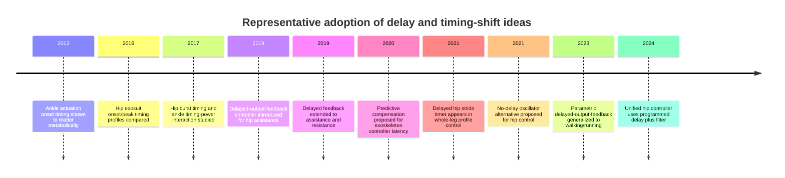
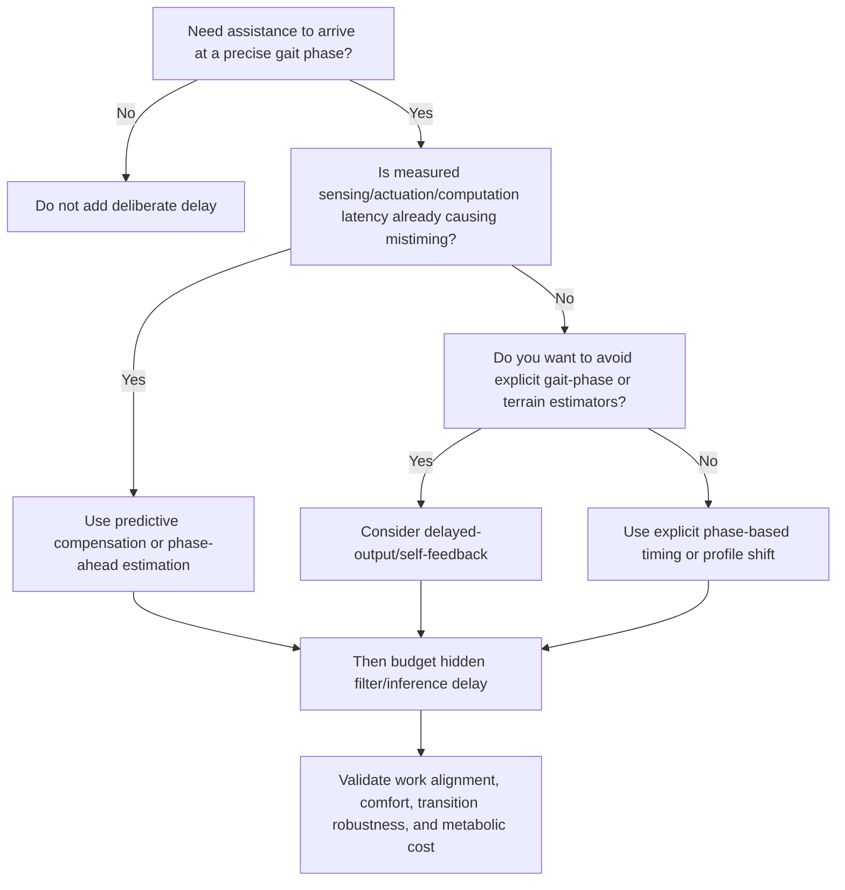

# Deliberate Delay in Exoskeleton Controllers

## Executive summary

Across lower-limb exoskeleton control, **deliberate delay is not a universal or dominant controller doctrine**. What is widespread is a broader timing design problem: assistance onset, gait-phase offsets, event-triggered profile timing, and compensation for sensing/actuation latency. The most relevant field-level review found that, for partial assistance, the dominant pattern is **event-triggered or oscillator-synchronized torque profiles**, and it explicitly noted that such profiles may include a **“tunable delay at the beginning of the torque profile.”** In that same review, synchronization coding yielded **98 event-triggered papers, 35 timing-imposed papers, and 11 manual-trigger papers**—strong evidence that **timing matters field-wide**, but weaker evidence that **delay itself** is a widespread formal controller architecture. citeturn8search0turn19search0turn19search1

The clearest exception is the **hip-exoskeleton literature**, where the delayed-output-feedback line led by entity["people","Bokman Lim","hip exoskeleton researcher"] made delay a first-class control variable rather than just a profile-tuning parameter. That line includes the 2019 IEEE T-RO hip paper, the 2019 IEEE RA-L assistance/resistance paper, and the 2023 IEEE RA-L parametric delayed-output-feedback paper. More recently, entity["people","Dean D. Molinaro","hip exoskeleton researcher"] and colleagues used an explicit programmed delay in a unified hip controller to increase positive exoskeleton work. By contrast, ankle exoskeleton papers more often use **actuation timing** or **reflex delay**, and knee exoskeleton papers more often target **assistance windows** such as early stance rather than true delayed-output feedback. So the best synthesis is: **delay is common as a timing/tuning device, uncommon as a standalone feedback paradigm, and most visible in hip exoskeletons.** citeturn18search3turn18search1turn18search5turn7view0turn21search3turn4view6turn22search1turn23search3

The recurrent motivations are consistent across papers: **phase alignment with gait mechanics**, **compensation for controller/sensor/actuator latency**, **smoothing and noise rejection**, **simplifying control by avoiding explicit gait-state estimation**, **preventing discontinuities or discomfort**, and, in some hip studies, **increasing positive mechanical work**. The theoretical support is uneven. The delayed-output-feedback papers cite delayed self-feedback for oscillatory systems, but most exoskeleton papers justify delay **empirically**—metabolic cost, delivered work, comfort, or tracking/timing accuracy—rather than with closed-loop Lyapunov or passivity proofs for the human–exoskeleton system. Where formal control theory is strongest, it often appears in **non-delay alternatives**, especially energy-shaping/passivity-based hip control. citeturn18search3turn10search0turn20search0turn7view0turn17view0

## Search strategy and inclusion criteria

I searched English-language sources from roughly **2005 to April 2026**, prioritizing **primary and official sources**: publisher pages and abstracts from IEEE/ACM citation pages, Springer JNER pages, Frontiers, PLOS, Science/AAAS, PubMed/PMC, and arXiv when official full text was otherwise inaccessible. Search strings combined terms such as **“delayed output feedback hip exoskeleton,” “exoskeleton assistance timing,” “controller delay exoskeleton,” “phase delay hip exoskeleton,” “predictive delay compensation exoskeleton,” “filter delay exoskeleton,”** and **“energy shaping hip exoskeleton.”** I also searched the exact phrase **“energy gate”** with exoskeleton terms; I did **not** locate a retrievable paper under that exact label, so I used the closest accessible proxy literature on **energy-shaping hip exoskeleton control** from entity["people","Robert D. Gregg","robotics researcher"]’s group. citeturn17view0

A paper was included if delay or timing offset was an **explicit design element** of the controller: fixed time delay, delayed output feedback, phase/onset delay, delayed profile reset, intentional filter-induced latency, reflex delay, or predictive compensation of measured latency. I excluded papers that mentioned delay only as an incidental low-level hardware nuisance without integrating it into controller design. The resulting synthesis is **analytical rather than bibliometric**: it is based on a screened corpus of representative primary papers and one field-level review, not on an exhaustive count of every exoskeleton paper. citeturn19search1

## Prevalence over time and across device types

Within the screened corpus, **hip papers accounted for the largest share of explicit delay-centric designs**. Hip examples include delayed-output-feedback controllers, stride/profile delay, programmed FIFO-buffer delay, and profile-reset delay. Ankle examples are numerous too, but they are usually framed as **actuation timing optimization** or **biologically inspired reflex delay**, not delayed self-feedback. Knee examples exist, but in this corpus they are sparse and mostly concern **assistance phase selection** such as early stance. This is consistent with the broader review evidence: exoskeleton control is timing-sensitive across the field, but **formal delayed-feedback control is not the norm**. citeturn18search3turn18search1turn18search5turn4view4turn4view5turn21search3turn4view6turn22search1turn23search3turn19search1

A useful historical pattern is visible. Early ankle papers established that **assistance timing strongly affects metabolic outcome**. Mid-2010s hip studies then optimized onset and peak timing of assistive torque profiles. The late 2010s introduced the more explicit delayed-output-feedback hip line. Early 2020s work diversified: some groups adopted **predictive delay compensation** or **predictive gait-phase estimation** to reduce reliance on mechanical delay, while others embedded deliberate delay inside more autonomous hip controllers. citeturn21search3turn4view6turn4view5turn4view4turn18search3turn18search1turn10search0turn24search1turn24search6turn7view0

The timeline is grounded in representative papers by entity["people","Philippe Malcolm","ankle exoskeleton researcher"], entity["people","Ye Ding","biomechatronics researcher"], entity["people","Aaron J. Young","biomechatronics researcher"], Lim and colleagues, Ming Ding and colleagues, and Molinaro and colleagues. citeturn21search3turn4view5turn4view4turn18search3turn18search1turn10search0turn15search2turn3search3turn18search5turn7view0

## Technical forms of delay and their stated purposes

The literature uses “delay” in at least five distinct ways. The most explicit is **fixed delayed output feedback**. Lim’s 2019 hip paper describes a controller based on **“time delayed, self-feedback”** and emphasizes that there are **“no separate estimators for the gait phase nor the environment.”** The 2019 RA-L follow-up extends the idea to both assistance and resistance by applying a time delay and positive/negative feedback gain to a smoothed state variable, and the 2023 parametric version makes **smoothing factor, time delay, and feedback gain** the three adjustable parameters. The explicit purposes are controller simplification, robustness across gait patterns, and operation without separate gait-state or terrain recognizers. citeturn18search3turn18search1turn18search5

A second form is **phase delay or profile timing shift**, which is much more widespread. Hip studies by Ding and by Young optimized onset and peak timing of hip assistance profiles for metabolic benefit and power alignment. Ankle studies by Malcolm and by Galle likewise treated actuation onset timing as a first-order design variable; Galle explicitly summarized earlier findings as an optimum **around 40% of stride**, while Malcolm reported benefit when actuation started **just before opposite heel contact**. In these papers, the point is not “delay control” in the control-theory sense; it is **precise phase alignment with gait mechanics**. citeturn4view5turn4view4turn21search3turn4view6

A third form is **buffer/profile delay or delayed profile reset**. Bryan’s whole-leg exoskeleton controller reset the hip profile at **84% of stride**, creating a **“delayed hip stride timer”** whose purpose was to allow assistance through heel strike without discontinuity. Molinaro’s 2024 controller delayed the estimated hip moment through a **FIFO buffer** before commanding the exoskeleton. In both cases, delay is used not because delay is intrinsically good, but because it improves profile continuity or favorable work alignment. citeturn15search2turn7view0

A fourth form is **intentional latency via filtering**. This is often under-discussed but practically important. In the 2024 Science Robotics controller, the delayed torque was then low-pass filtered, adding **another 25 ms** of delay. In the 2024 Frontiers hip-controller comparison, desired torques were low-pass filtered to avoid discomfort during a transition occurring over about **100 ms**. So even papers that are not philosophically “about delay” often carry **hidden effective delay** through filtering and inference latency. citeturn7view0turn20search0

A fifth form is **predictive delay compensation**. Ming Ding and colleagues treated hardware/controller delay as a real problem and predicted future plantar force and walking status so the system could **send the control commands beforehand**. Their worked example gave a total delay of about **0.124 s**. Related hip papers on predictive locomotion-mode recognition or real-time gait-phase estimation serve the same broader purpose: keep assistance synchronized **without** relying on deliberately delayed feedback. The 2021 “no-delay” hip controller makes that contrast explicit. citeturn10search0turn11search1turn24search1turn24search6turn3search3

Representative phrases capture the field well:

> “tunable delay at the beginning of the torque profile.” citeturn8search0

> “time delayed, self-feedback.” citeturn18search3

> “no separate estimators for the gait phase nor the environment.” citeturn18search3

> “sending the control commands beforehand.” citeturn10search0

## Theory, implementation details, and trade-offs

Theoretical justification is uneven. The delayed-output-feedback hip papers explicitly invoke delayed self-feedback **“known for stabilizing oscillatory systems under certain conditions,”** but the accessible abstracts do not provide a full closed-loop stability theory for the coupled human–exoskeleton system. Most timing and delay decisions in exoskeleton papers are instead justified **empirically**—through metabolic cost reductions, user preference, comfort, or better mechanical work timing. The closest accessible rigor in this design space comes from the energy-shaping proxy literature, which models the human–exoskeleton system as a **port-controlled Hamiltonian system** and designs assistance using **IDA-PBC**. That is rigorous control theory, but it is largely an **alternative to delay-centric design**, not a proof that deliberate delay is optimal. citeturn18search3turn17view0

The reported magnitudes are heterogeneous. In accessible abstracts, the exact fixed-delay values in the Lim papers are **unspecified**. In Bryan’s whole-leg controller, the hip timer reset at **84% of stride**. In Molinaro’s hip controller, a **100 ms programmed delay** plus low-pass filtering yielded **125 ms total delay**, and pilot tests explored **75–175 ms**; users reportedly preferred **100–150 ms**, and delays below **35 ms** could not be tested because of existing filter and inference latency. In Ding’s predictive compensation paper, a representative total measured-plus-computed delay was **~0.124 s**. In ankle neuromuscular control, reflex delay was explicitly swept through **10, 20, 30, and 40 ms**. In the timing-optimization literature, magnitudes are usually expressed in **gait phase** instead of milliseconds: hip extension around **90% gait cycle**, hip flexion around **50%**, ankle onset around **40% of stride**, or just before opposite heel contact. citeturn15search2turn7view0turn11search1turn22search1turn4view4turn21search3turn4view6

The trade-offs are also consistent. First, **mistiming costs performance**: ankle and hip studies both show strong sensitivity of metabolic benefit to assistance timing. Second, **longer predictive horizons degrade accuracy**, so delay compensation is not free. Third, **small delays can be uncomfortable**, and filter-induced lag imposes a lower bound on what can be realized. Fourth, some delays improve mechanics without improving metabolism: in the ankle reflex-delay study, increasing delay changed exoskeleton mechanics but did not yield metabolic-rate changes. Fifth, explicit safety-or-comfort uses of delay are present but modest: the best examples are delayed hip reset to avoid discontinuity and filtering to avoid discomfort, rather than formal safety gating. citeturn21search1turn4view4turn10search0turn7view0turn22search1turn15search2turn20search0

On the user’s requested “energy gate” dimension: I did not find a retrievable paper under that exact label. The closest public proxy is **energy-shaping hip control**, which uses formal passivity-based design and is relevant as a principled alternative when one wants energetic modulation or safety-aware shaping without relying on explicit delay. citeturn17view0

## Comparative table of key papers

The table below codes only papers in which delay/timing was explicit enough to identify a controllable design choice.

| Authors, year | Device | Delay type | Delay magnitude | Purpose | Evidence | DOI / key link |
|---|---|---|---|---|---|---|
| Lim et al., 2019 | Hip | Delayed output feedback | Unspecified | Simplify control; avoid gait-phase/environment estimators | Human walking; abstract states “time delayed, self-feedback” and no separate estimators. citeturn18search3turn18search11 | 10.1109/TRO.2019.2913318 |
| Lim et al., 2019 | Exoskeleton assistance/resistance | Delayed output feedback with smoothed state | Unspecified | Generate assistive or resistive torque without gait/environment recognition | Abstract says assistance/resistance arise from delayed state plus positive/negative gain. citeturn18search1turn18search19 | 10.1109/LRA.2019.2927937 |
| Lim et al., 2023 | Human–exoskeleton walking/running | Parametric delayed output feedback | Unspecified | Versatile operation during gait-pattern changes | Abstract: smoothing factor, time delay, and feedback gain are adjustable parameters. citeturn18search5turn18search15 | 10.1109/LRA.2023.3284351 |
| Ding et al., 2016 | Hip soft exosuit | Profile timing shift | ~90% onset; peak ~13–17% GC | Align assistance with hip velocity/power; improve metabolic cost | Four onset/peak timing profiles compared experimentally. citeturn4view5 | 10.1186/s12984-016-0196-8 |
| Young et al., 2017 | Hip | Burst timing / phase delay | Extension 90% GC; flexion 50% GC best on average | Optimize metabolic benefit via timing | Timing sweep across subjects; strong subject dependence. citeturn4view4 | 10.3389/fbioe.2017.00004 |
| Bryan et al., 2021 | Hip–knee–ankle | Delayed hip stride timer / profile reset delay | Hip reset at 84% stride | Avoid torque discontinuity at heel strike | Explicit “delayed hip stride timer.” citeturn15search2 | 10.1186/s12984-021-00955-8 |
| Molinaro et al., 2024 | Hip | FIFO buffer + filter delay | 100 ms programmed; 125 ms total; pilot 75–175 ms | Increase positive work; smooth output; align with preference | Paper states 125 ms could theoretically increase positive work by 70%. citeturn7view0turn20search9 | 10.1126/scirobotics.adi8852 |
| Malcolm et al., 2013 | Ankle | Actuation onset timing | Phase-based; onset just before opposite heel contact | Optimize metabolic cost | Classic timing-sensitivity result. citeturn21search3 | 10.1371/journal.pone.0056137 |
| Galle et al., 2017 | Ankle | Actuation timing-power interaction | Optimum around 40–42% stride | Optimize metabolic cost and power timing | JNER paper explicitly frames timing as crucial. citeturn4view6turn2search6 | 10.1186/s12984-017-0235-0 |
| Shafer et al., 2021 | Ankle | Reflex delay in neuromuscular model | 10, 20, 30, 40 ms | Explore mechanics and physiology of biologically inspired delay | Delay changed power output but did not change metabolic rate. citeturn22search1turn22search2 | 10.3389/fbioe.2021.615358 |
| Lee et al., 2020 | Knee | Assistance window timing | Early stance phase | Target high-work period of incline/decline gait | Phase-specific assistance, not delayed self-feedback. citeturn23search3 | 10.1109/TNSRE.2020.2972323 |
| Ding et al., 2020 | Walking-assist exoskeleton | Predictive delay compensation | ~0.124 s total example | Compensate sensing/computation/actuator delay | Commands sent “beforehand” using predicted plantar force/status. citeturn10search0turn11search1 | 10.1109/ACCESS.2020.3010644 |

The table reinforces the central pattern: **hip papers contain the strongest examples of deliberate delay as a controller variable**, while **ankle and knee papers more often treat delay as timing selection, reflex modeling, or latency compensation**. citeturn18search3turn4view4turn21search3turn22search1turn23search3

## Open gaps and recommended experiments

The biggest gap is that hip-exoskeleton delay strategies remain **under-standardized**. The literature shows that timing matters greatly and that explicit delay can be useful, but there is still no convincing, cross-task answer to **when fixed delay is better than phase-based timing, predictive compensation, or no-delay prediction-based control**. A second gap is **theory**: the delay papers are compelling and practical, but much of their support is empirical rather than formal. A third gap is **latency accounting**: many papers report filtered or delayed commands, but fewer separate **true hardware delay**, **inference delay**, **filter delay**, and **intentional program delay**. citeturn18search3turn10search0turn24search1turn3search3turn7view0turn20search0

For hip exoskeletons specifically, the most valuable next experiments would be head-to-head comparisons on the **same hardware** across **level walking, ramps, stairs, starts/stops, and overground variability**. The controllers to compare are: fixed millisecond delay, phase-normalized delay, predictive compensation, a no-delay predictive/oscillator baseline, and a theory-driven non-delay alternative such as energy shaping. The dependent variables should include not only metabolic cost, but also delivered positive work, phase error relative to biological hip moment, comfort/preference, perturbation recovery, transition failure rate, and measured end-to-end latency. That recommendation is an inference from the existing literature rather than a claim that such a full study already exists. citeturn7view0turn10search0turn24search1turn24search6turn17view0

The decision logic above is the most defensible synthesis of the current hip literature: use deliberate delay when it solves a **timing problem** or a **controller-simplification problem**, not as a default design habit. citeturn8search0turn18search3turn10search0turn7view0turn17view0